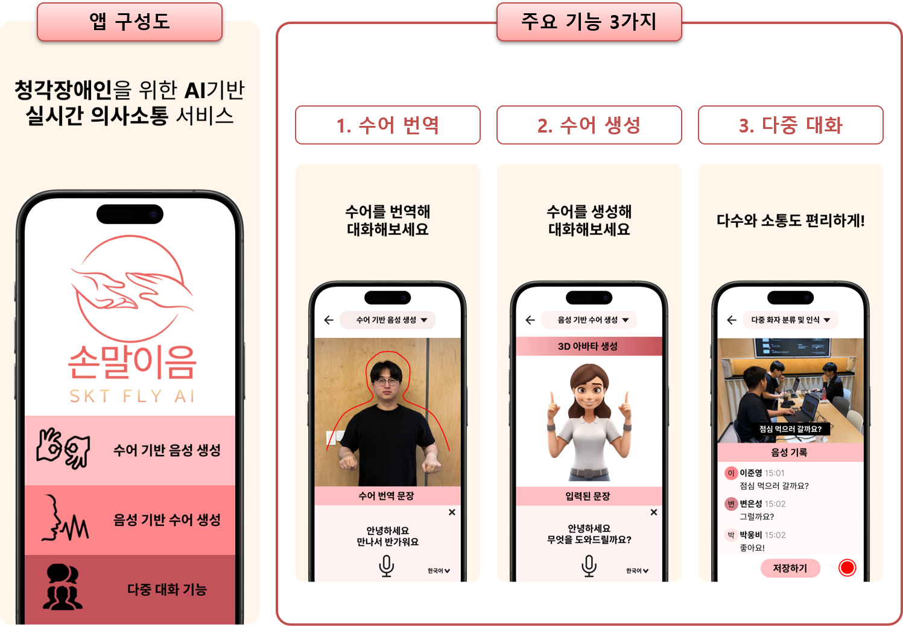

# 손말이음 - 청각장애인을 위한 AI 기반 실시간 의사소통 서비스


*Figure: Sonmalyieum Project Overview and Key Features*

## Overview

**손말이음 (Sonmalyieum)** is an AI-based real-time communication service designed to bridge the communication gap between hearing-impaired and non-impaired individuals.

- Developed during the **SKT FLY AI Academy**, the project incorporates three core functionalities:
  1. **수어번역 (Sign2Speech)** – Real-time translation of Korean Sign Language (KSL) into text and speech.
  2. **수어생성 (Speech2Sign)** – Converts spoken language into sign language using a 3D avatar.
  3. **다중대화 (Multi-party Communication)** – Facilitates group conversations, translating between speech and sign language in real-time.

This repository specifically includes the code for the **Sign2Speech** feature, which allows for real-time translation of KSL gestures into both text and speech.

## Sign2Speech Feature

This functionality enables users to:

- Convert KSL gestures into both written and spoken language.
- Assist non-impaired users in understanding sign language during conversations.
- Provide real-time translation using an AI-based sign recognition model that analyzes video input.

## Dataset
The Sign2Speech functionality was developed using the **KSL-GUIDE** dataset, a large-scale Korean Sign Language dataset designed for guiding the deaf and hard-of-hearing. The key reference for this dataset is:

- Ham, Soomin, et al. "Ksl-guide: A large-scale Korean sign language dataset including interrogative sentences for guiding the deaf and hard-of-hearing." 2021 16th IEEE International Conference on Automatic Face and Gesture Recognition (FG 2021). IEEE, 2021.

## Key Features
- **Sign2Speech**: Real-time sign language translation to text and speech.
- **Speech2Sign**: (Not included in this repository) Converts spoken language into sign language using a 3D avatar.
- **Multi-party Communication**: (Not included in this repository) Facilitates group communication with real-time speech and sign language translation.

## How to Use

1. **Clone the repository**:
   ```bash
   git clone https://github.com/your-username/Sign2Speech_inf.git
